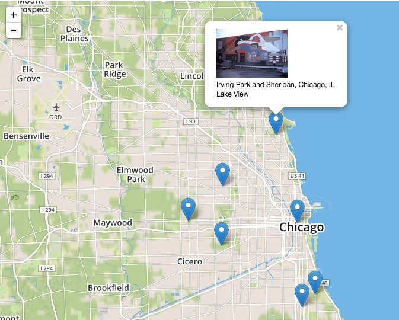

Preliminary work for on a geovisualization project for Rebecca Zorach (Art History).

Prof Zorach is working on a project to catalog murals around the city of chicago.  She's interested in an interactive map of the Chicago area that could be used for viewing mural images and their associated metadata (artist, date of creation, location in the city, etc).

We extracted out the unique locations, geocoded them, and [converted to geojson](data-sample/data.geojson).  See resulting [map](http://rcc-uchicago.github.io/murals/) or the [data sample](data-sample) directory for details.

See also the [demos](demos.md) page for various examples of mapping visualizations that enable you to filter place markers on a map based on one or more attributes associated with the markers.
