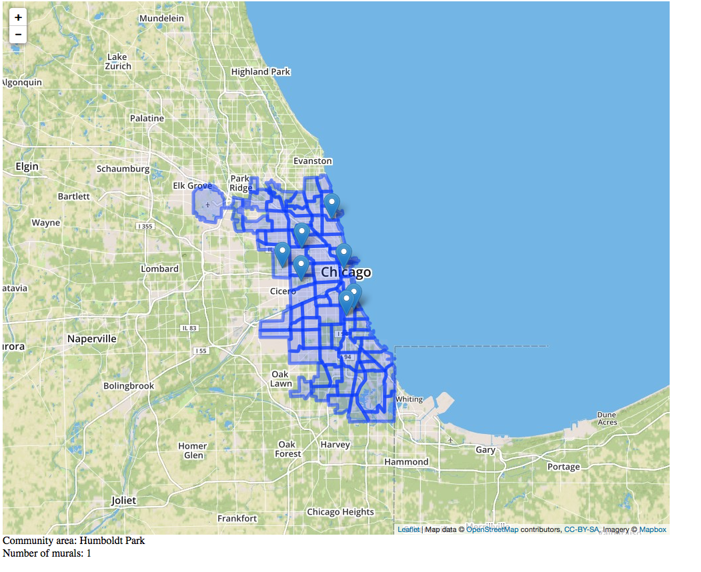
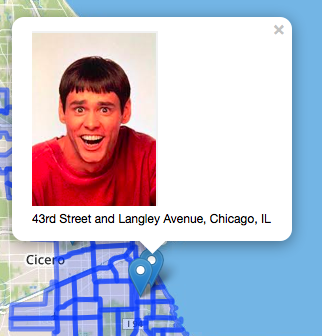

# Geoviz Demo

This is an early-stage demo showing how to visualize geo data and images with [leaflet.js](http://leafletjs.com/).

The markers indicate a mural location and show a mock image when clicked.  Simon also added a layer highlighting Chicago communities, demonstrating leaflet's layering capabilities.  If you click on a community area, you can see how many murals are in that area in a text box below the map.

## Data

* [`murals.geojson`](murals.geojson) contains mural locations.
* [`regions.geojson`](community-areas.json) is based on source data coming from the city of Chicago's [data portal](https://data.cityofchicago.org/Facilities-Geographic-Boundaries/Boundaries-Community-Areas-current-/cauq-8yn6) and converted into `geojson`  with [`togeojson`](https://github.com/mapbox/togeojson).

## Screenshots

