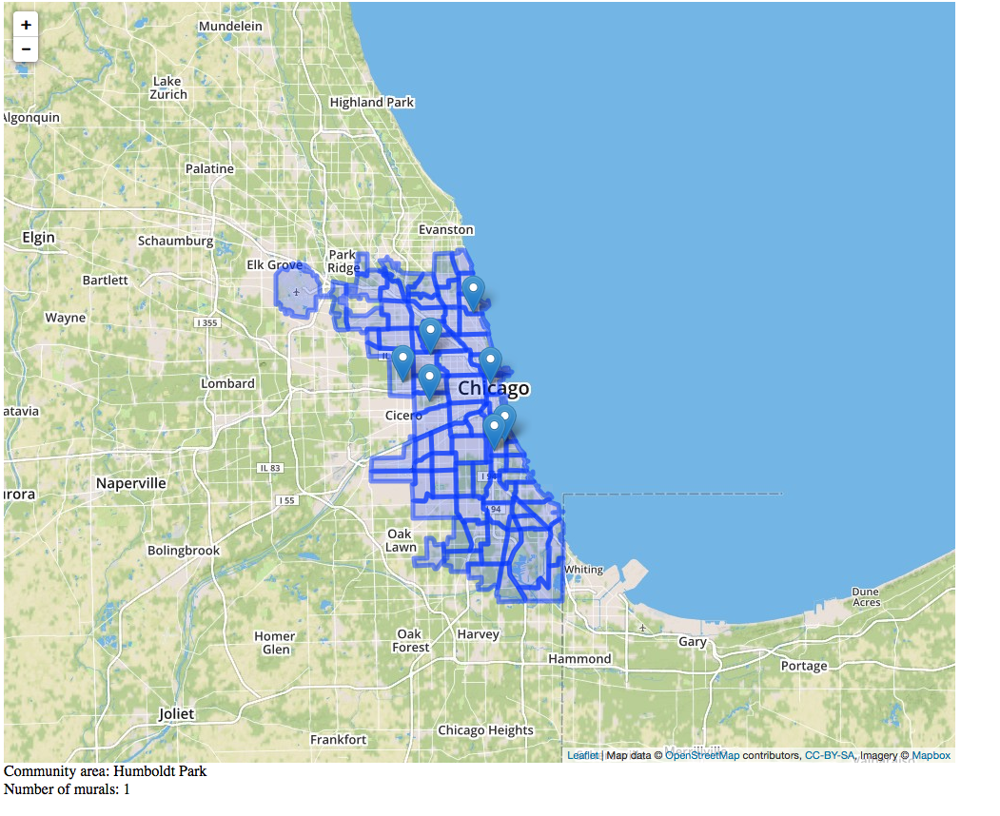
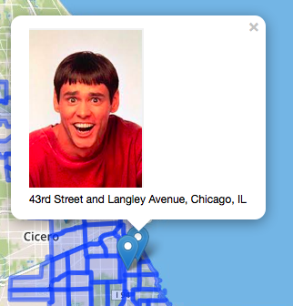

This is a demo in progress of how to visualize geographic data and images with leaflet.js.
Right now, it shows points where the images are, and will show an image if you click on the point (the images are junk,
not the actual mural data).
We also have a layer showing the community areas, as an example of how to put in other geographic data. If you click on
a community area, you can see how many murals are in that area in a text box below the map.

#### Data
- [data.geojson](data.geojson) came from the `data-sample` directory. It was manually annotated with community area data - this
step should ultimately be automated.
- [community-areas.json](community-areas.json) is from the city's [data portal](https://data.cityofchicago.org/Facilities-Geographic-Boundaries/Boundaries-Community-Areas-current-/cauq-8yn6).

#### Screenshots

